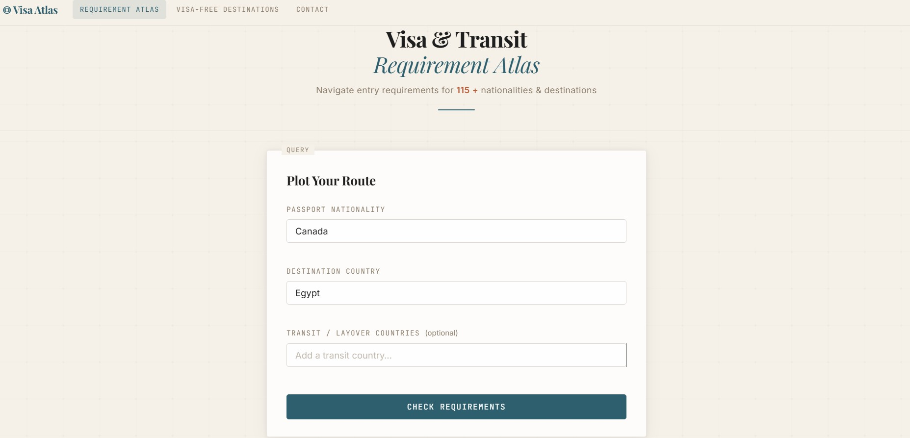
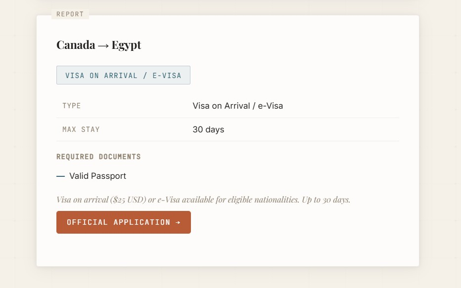
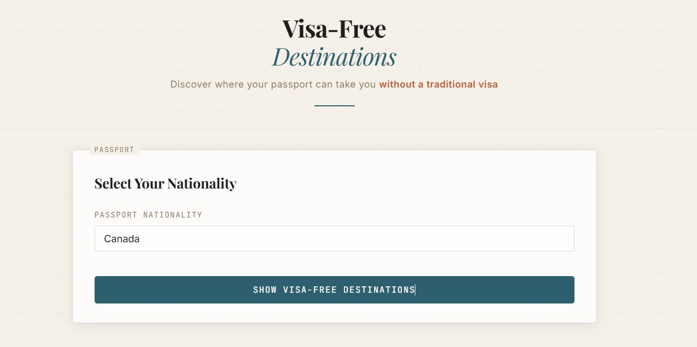
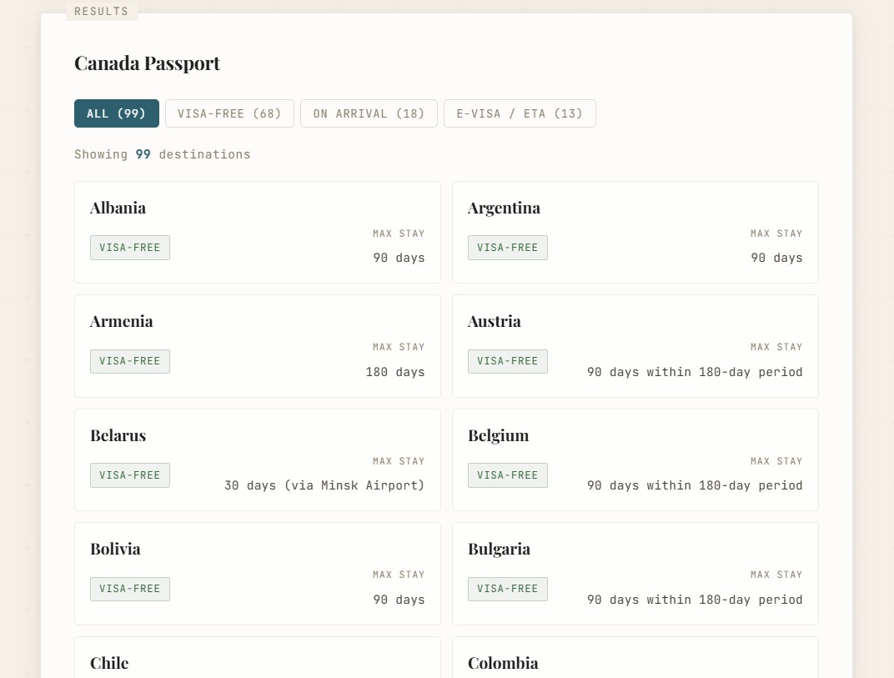
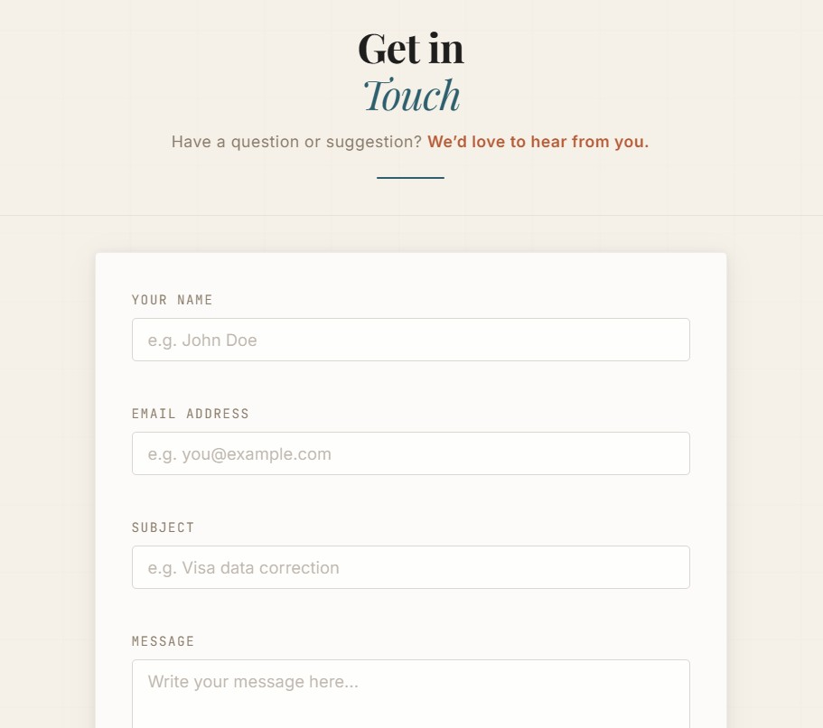

# Visa & Transit Requirement Atlas

A full-stack Node.js application that resolves visa and transit requirements across 140 countries using a priority-based rules engine. The system evaluates nationality–destination pairs against 180+ explicit rules, 39 country groups, and 18 transit hub configurations to return visa type, maximum stay, required documents, and application links.

---

## Screenshots

### Visa Checker


### Visa Results


### Visa-Free Explorer


### Visa-Free Explorer Results


### Contact Page


---

## Architecture

```
├── backend/
│   ├── server.js                # Express server, CORS, static serving, route mounting
│   ├── routes/
│   │   └── visaRoutes.js        # REST API handlers + visa resolution algorithm
│   └── data/
│       ├── visaRules.json       # Rules engine dataset (groups, rules, transit, links)
│       └── messages.json        # Persisted contact form submissions
├── frontend/
│   ├── index.html               # Visa checker interface
│   ├── app.js                   # Checker logic, autocomplete, result rendering
│   ├── visa-free.html           # Visa-free explorer interface
│   ├── visa-free.js             # Explorer logic, category filtering, grid rendering
│   ├── contact.html             # Contact form interface
│   ├── contact.js               # Form validation, submission, canvas animation
│   └── style.css                # Global styles, responsive layout
└── package.json
```

| Layer | Stack |
|-------|-------|
| Server | Node.js, Express 4 |
| API | RESTful JSON endpoints |
| Data | JSON rules engine (no database) |
| Email | Nodemailer over Gmail SMTP |
| Frontend | Vanilla JS, HTML5, CSS3 |

---

## Visa Resolution Algorithm

The core of the application is a priority-based fallback resolver in `visaRoutes.js`. Given a `(nationality, destination)` pair, it walks this chain until a match is found:

```
1. Explicit pair lookup       →  visaRules["Germany-Japan"]
2. EU ↔ EU freedom of movement
3. Destination-specific handler (US → VWP/ESTA check, UK → visa-free list, etc.)
4. Group membership fallback  →  STRONG_PASSPORTS, US_VWP, MERCOSUR, etc.
5. Universal destination rule →  ANY_to_INDIA, ANY_to_CHINA, etc. (26 countries)
6. Passport strength heuristic →  strong passport → "likely visa required"
7. General fallback           →  visa required, contact embassy
```

Each resolved rule returns:

```json
{
  "visaRequired": true,
  "visaType": "eVisa",
  "maxStay": "30 days",
  "documents": ["Valid Passport", "eVisa Approval", "Hotel Booking"],
  "applicationLink": "https://...",
  "notes": "Processing takes 3-5 business days."
}
```

### Transit Processing

Transit countries are resolved against 18 hub configurations. Each hub defines an array of nationalities that require a transit visa. Hubs with strict policies (US, UK, India) flag most nationalities; open hubs (UAE, Singapore, Qatar) allow visa-free transit by default.

| Hub | Policy |
|-----|--------|
| United States | No airside transit — ESTA or visa always required |
| United Kingdom | DATV (Direct Airside Transit Visa) for 38 nationalities |
| Germany, France, Netherlands | Schengen ATV for 12 nationalities |
| India | Transit visa required for all foreign nationals |
| Canada | Transit visa or eTA required for 54 nationalities |
| Australia | Subclass 771 transit visa for 54 nationalities |
| China | 24/72/144-hour transit exemption available |
| UAE, Qatar, Singapore, Japan, South Korea, Turkey, Brazil, Malaysia, Thailand | Visa-free airside transit |

---

## Data Model

All visa data lives in `visaRules.json` with the following structure:

### Countries
Array of 140 supported countries used for validation and autocomplete.

### Country Groups (39 groups)
Named arrays that classify countries by visa agreements and geopolitical groupings:

| Group | Example Members | Count |
|-------|----------------|-------|
| `EU_SCHENGEN` | Germany, France, Italy, Spain | 29 |
| `US_VWP` | UK, Japan, Australia, South Korea | 35 |
| `UK_VISA_FREE` | US, Canada, Japan, Singapore | 56 |
| `STRONG_PASSPORTS` | Germany, Japan, Singapore, South Korea | 27 |
| `MERCOSUR` | Argentina, Brazil, Paraguay, Uruguay | 9 |
| `SCHENGEN_ATV_REQUIRED` | Afghanistan, Iraq, Somalia | 12 |
| `UK_DATV_REQUIRED` | Afghanistan, Bangladesh, Iran | 48 |

Plus 32 destination-specific groups (e.g., `JAPAN_VISA_FREE`, `SAUDI_EVISA`, `EGYPT_VOA`).

### Group Rules (38 rules)
Default visa requirements applied when a nationality falls into a group:

- `EU_to_EU` → Freedom of movement, unlimited stay
- `US_VWP_to_US` → ESTA, 90 days
- `STRONG_to_SCHENGEN` → Visa-free, 90 days within 180
- `ANY_to_INDIA` → eVisa, 90 days
- `DEFAULT_to_CANADA` → TRV (Temporary Resident Visa)

### Explicit Pair Rules (180+ pairs)
Override rules for specific nationality–destination combinations (e.g., `"United States-Cuba"`, `"India-Nepal"`).

### Transit Rules (18 hubs)
Each hub defines `transitVisaRequired[]` (nationalities needing a transit visa), `notes`, and `applicationLink`.

### Schengen Application Links (20 portals)
Direct visa application URLs for each Schengen member state embassy.

---

## API Reference

### `GET /api/countries`

Returns the list of all supported countries.

**Response:**
```json
{ "countries": ["Afghanistan", "Albania", ..., "Zimbabwe"] }
```

### `POST /api/check-visa`

Resolves visa and transit requirements for a trip.

**Request Body:**
```json
{
  "nationality": "Nigeria",
  "destination": "Germany",
  "transit": ["United Kingdom"]
}
```

**Response:**
```json
{
  "nationality": "Nigeria",
  "destination": "Germany",
  "visa": {
    "visaRequired": true,
    "visaType": "Schengen Visa (Type C)",
    "maxStay": "Up to 90 days within a 180-day period",
    "documents": ["Valid Passport", "Schengen Visa Application", "..."],
    "applicationLink": "https://videx.diplo.de",
    "notes": "...",
    "message": "You will need a visa (Schengen Visa (Type C)) before traveling to Germany."
  },
  "transit": [
    {
      "country": "United Kingdom",
      "transitVisaRequired": true,
      "notes": "...",
      "applicationLink": "https://...",
      "message": "Transit visa REQUIRED when transiting through United Kingdom."
    }
  ],
  "hasTransitIssues": true
}
```

**Validation:**
- `nationality` and `destination` are required and must be in the supported list
- Case-insensitive country matching
- Nationality and destination cannot be the same
- All transit countries are validated individually

### `GET /api/visa-free/:nationality`

Returns all destinations accessible without a traditional visa (visa-free, visa on arrival, e-Visa, eTA, ESTA, tourist card).

**Response:**
```json
{
  "nationality": "Germany",
  "total": 134,
  "destinations": [
    {
      "destination": "Argentina",
      "visaType": "Visa-Free",
      "maxStay": "90 days",
      "visaRequired": false,
      "notes": "..."
    }
  ]
}
```

Results are sorted: visa-free first, then alphabetically.

### `POST /api/contact`

Validates and stores a contact form submission. Optionally sends an email notification via Gmail SMTP.

**Request Body:**
```json
{
  "name": "John Doe",
  "email": "john@example.com",
  "subject": "Data correction",
  "message": "..."
}
```

Input is sanitized and truncated (name/email: 200 chars, subject: 300 chars, message: 5000 chars). Messages are persisted to `messages.json`. Email delivery requires `SMTP_USER` and `SMTP_PASS` environment variables; the endpoint returns `200` regardless of email delivery status.

---

## Setup

```sh
git clone https://github.com/medo-com/visa-atlas.git
cd visa-atlas
npm install
npm start
```

Server starts on `http://localhost:3000` (or `PORT` env variable).

### Environment Variables

| Variable | Required | Description |
|----------|----------|-------------|
| `PORT` | No | Server port (default: `3000`) |
| `SMTP_USER` | No | Gmail address for contact email delivery |
| `SMTP_PASS` | No | Gmail app password for SMTP authentication |


